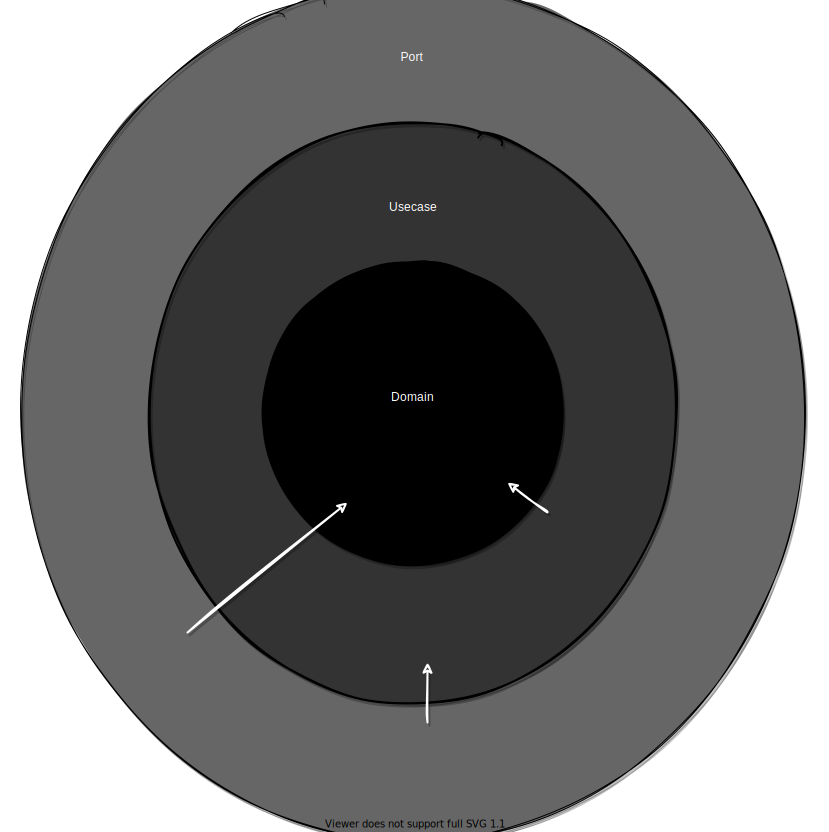

# App layers pokemonstore

> Пример гошного приложения в трёхслойной архитектуре "порты, юзкейсы и домены" со сквозными зависимостями



- _Порты_ зависят от _юзкейсов_ и _доменов_
- _Юзкейсы_ зависят от _доменов_
- _Домены_ ни от чего не зависят (иногда друг от друга)

```
assets/
internal/
├── cmd/
│   └── pokemonstore/main.go 
├── domain/
│   ├── x
│   └── y
├── port/
│   └── grpc
└── usecase/
    ├── x
    └── y
```
